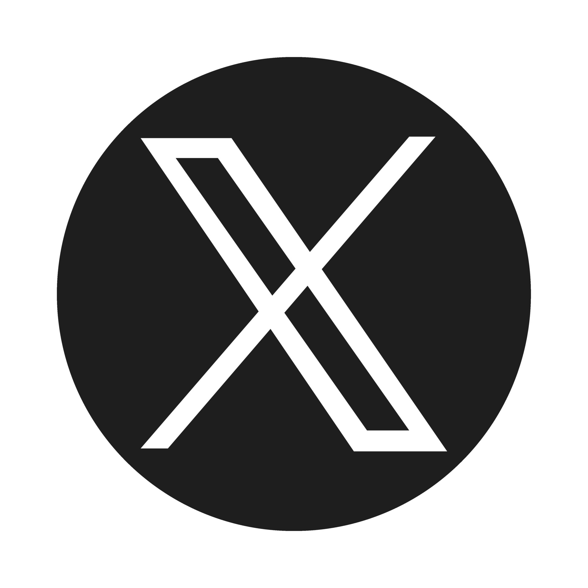

# Hi 👋, I'm Adarsh Nair

## About Me

A passionate software engineer and enthusiast in Web Development and Salesforce developer. My journey in the tech world has led me to specialize in JavaScipt, Mern Stack, CPP and Salesforce. I love to explore and contribute to open-source projects while continuously learning and growing in the field.

### 🚀 Current Status

- 🌱 I'm currently learning and exploring Game Development.
- 💼 Working on myself to be better developer.
- 🔭 I’m passionate about trying and learning new tech stacks.

### Background

- 💻 Currently working as a Developer at Tryzens.
- 🌟 Languages and Tools:

            

      

### Interests

In my free time, I enjoy Playing Chess and Going to GYM. I believe in the power of community and collaboration and am always open to connecting with like-minded individuals or working on exciting projects.

### 📫 Connect with Me

Feel free to reach out if you share similar interests or have exciting ideas to collaborate on! Let's connect and build something amazing together.

&nbsp;
 

